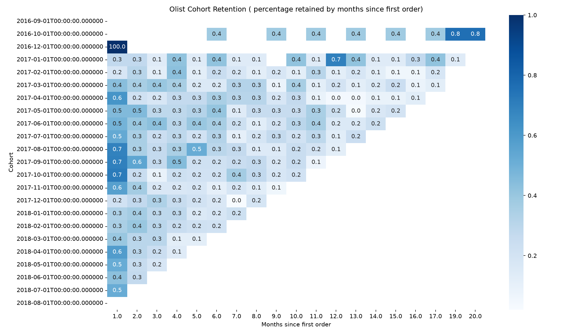

churn-analytics-sql-to-ml

An end-to-end analytics-engineering pipeline on PostgreSQL — raw e-commerce data loaded into a proper multi-table schema, all analysis and feature engineering done in SQL inside the database, a churn model that reads those features via SQLAlchemy, and predictions written back into the database where they can be queried like any other table.

The defining idea is a closed loop:

data in → analysis in SQL → features in SQL → model in Python → predictions back into SQL → surfaced by SQL

You work where the data actually lives, not in an isolated notebook.

Stakeholder question

An e-commerce business is losing customers to inactivity. Which cohorts stop coming back, why, and which customers are most at risk of not purchasing again — answered live from the database, not a flat CSV?

Dataset — Olist Brazilian E-Commerce

The Olist public dataset: ~100k orders placed 2016–2018, spread across nine relational tables (orders, order items, customers, payments, reviews, products, sellers, geolocation, category translation). Chosen over Telco Churn because its real timestamps and transactions are what make cohort retention and RFM possible.

Defining churn: Olist has no subscription and no built-in churn label, so churn is defined here as a customer whose most recent delivered order is more than 180 days before the snapshot date (the latest order date in the data, ~Oct 2018). Olist skews heavily toward one-time buyers (only ~3% ever place a second order), which is itself central to the retention story this project surfaces. See docs/churn_definition.md for the full definition and reasoning.

Stack

PostgreSQL · SQL (CTEs, window functions) · SQLAlchemy · pandas · scikit-learn Tooling: Docker, git/GitHub, dbdiagram.io (schema diagram)

Repo structure
churn-analytics-sql-to-ml/
├── data/            # raw Olist CSVs (git-ignored)
├── schema.sql       # DDL: tables, primary/foreign keys, constraints
├── load.py          # loads the CSVs into PostgreSQL (FK-safe order)
├── db.py            # SQLAlchemy engine + run_query(sql) -> DataFrame
├── queries/         # documented .sql files, one business question each
├── docs/            # data dictionary, churn definition, schema diagram (PNG)
├── results/         # captured query outputs
├── pipeline.py      # feature view -> model -> write predictions back (upcoming)
├── requirements.txt
├── .env.example     # DB connection template (never commit real .env)
└── README.md
Getting started

Prerequisites: Python 3.12 and Docker.

bash
# 1. Clone
git clone https://github.com/<you>/churn-analytics-sql-to-ml.git
cd churn-analytics-sql-to-ml

# 2. Postgres via Docker
#    If port 5432 is already in use (e.g. a native Postgres install),
#    map to another host port such as 5433 and set DB_PORT to match.
docker run --name churn-pg -e POSTGRES_PASSWORD=postgres -p 5433:5432 -d postgres

# 3. Python environment
python3.12 -m venv .venv && source .venv/bin/activate
pip install -r requirements.txt

# 4. Configure the connection
cp .env.example .env        # then edit with your DB credentials + the port above

# 5. Create the database (run inside the container)
docker exec -it churn-pg psql -U postgres -c "CREATE DATABASE olist;"

# 6. Build the schema and load the data
#    Download the Olist CSVs from Kaggle into ./data first.
docker exec -i churn-pg psql -U postgres -d olist < schema.sql
python load.py
Analytical Queries

Ten documented queries of escalating complexity, each tied to a business question — from simple churn cuts (CTEs) through window functions. Full SQL lives in queries/. Churn is defined as above and keyed throughout on customer_unique_id.

Q1 — Overall churn rate

Question: What share of customers have churned under the 180-day recency rule?

93,358 customers · 66,107 churned · 70.81% churn rate.

This is a recency-based churn rate, distinct from the ~3% repeat-purchase rate: churn here measures "bought a while ago and hasn't returned," not "never ordered twice." The two answer different questions.

Q2 — Churn by state

Question: How does churn rate vary by customer state?

Highest churn in AC (Acre, 82.9%), lowest in SP (Sao Paulo, 67.9%). The customer base is dominated by SP (~39,156 customers), so the overall rate largely reflects SP. Extreme rates appear only in small, low-population states where sample sizes make the figure unreliable.

Q3 — Churn by first-order-month (tenure cohorts)

Question: Does churn rate differ by the month a customer first ordered?

Churn sits at ~99% for 2016–early-2018 cohorts and drops to 0% from May 2018 onward. This is a right-censoring artifact: the 180-day window extends beyond the data's end (~Oct 2018), so recent cohorts have insufficient observation time to be labelled churned — not genuine loyalty.

Q4 — Churn by payment type

Question: How does churn rate vary by payment method?

Card users churn less: credit_card 53.5%, debit_card 47.4%, boleto 63.8%, voucher 73.4%. Suggests payment method correlates with customer commitment. Caveat: customers using multiple payment types are counted in each bucket, so per-type totals exceed the distinct customer count.

Q5 — Churn by spend tier

Question: Do higher-spending customers churn less?

Churn is flat across all spend quartiles (~70%) — no spend/churn relationship. Expected given the definition: churn is recency-driven while spend is basket-driven, and the two are largely independent for the one-time buyers who make up ~97% of the base. (A correctly-interpreted null result.)

Q6 — Customers ranked by lifetime value (ROW_NUMBER)

Question: Who are the highest lifetime-value customers?

Top customer spent R$13,664, with a steep drop-off after the top few (#2 ~= R$7,572, #20 ~= R$3,827). High-value customers are rare in a one-time-buyer marketplace.

Q7 — Month-over-month revenue (LAG)

Question: How does revenue change month over month?

Revenue grew from ~R$0 (late 2016) to ~R$1M/month by early 2018, then plateaued. The Nov 2017 spike (+R$402k) aligns with Black Friday. Early 2016 months are launch noise on near-zero volume.

Q8 — Cumulative revenue (running total)

Question: What is cumulative revenue over time?

Cumulative delivered revenue reaches ~R$15.4M by Aug 2018, with the curve steepening through 2017 as monthly revenue scales.

Q9 — Per-customer order sequence (ROW_NUMBER + PARTITION BY)

Question: What is each customer's chronological order sequence (1st, 2nd, 3rd...)?

Numbers each customer's orders in time order, restarting per customer. The most active customer placed 15 delivered orders; a handful reach 6–9; the vast majority sit at order_seq = 1, consistent with the ~97% one-time-buyer base. order_seq = 1 identifies each customer's first order — the basis for cohort assignment.

Q10 — Frequency segments (NTILE(5))

Question: How do customers segment into frequency quintiles?

Because ~97% of customers have exactly one order, NTILE(5) splits the tied one-time buyers across segments 1–4 (all min = max = 1); only segment 5 captures any repeat buyers. Demonstrates that NTILE's equal-count buckets break down on a heavily-skewed variable — recency or monetary dimensions segment far more cleanly.

## Cohort Retention Analysis

**Question:** Of customers who first purchased in a given month, what percentage
placed another order N months later?

Customers are grouped into cohorts by their first-order month, then tracked across
subsequent months. Full SQL in [`queries/04_cohort_retention.sql`](queries/04_cohort_retention.sql);
the long-format result is pivoted into the matrix below in pandas.

**Finding — retention is a cliff, not a curve.** Retention drops from 100% (signup
month) to roughly

## Churn Model

The churn model is kept deliberately modest — per the project's focus, the analytical
SQL is the core and the model is a demonstration of closing the loop, not a
high-accuracy predictor.

**Detecting and fixing target leakage.** An initial random forest scored a perfect
ROC-AUC of 1.0 — a red flag rather than a success. Investigation revealed **target
leakage**: `recency` was included as a feature, but the churn label is *defined* as
recency > 180 days, so the model was simply reverse-engineering the labelling rule
(recency alone accounted for 99% of its feature importance). Removing `recency`
produced honest results.

**Results (after fixing leakage).** Two models were trained on the SQL `feature_view`
(spend, order count, tenure, review score), with `class_weight='balanced'` to handle
the ~71/29 class imbalance and evaluated on a stratified hold-out set:

| Model | ROC-AUC |
|---|---|
| Logistic Regression | 0.55 |
| Random Forest | **0.71** |

Logistic regression found almost no linear signal (0.55, near-random); random forest
captured non-linear structure and reached a respectable **0.71**. Feature importances
identify **spend (`avg_spend`, `total_spend`) as the dominant behavioural predictor of
churn** — consistent with the RFM analysis — while review score, tenure, and order
count contribute little.

**Interpretation.** The modest AUC is the honest result for a one-time-purchase
marketplace: once recency is correctly excluded, churn is only weakly predictable from
behavioural features. This reinforces the project's thesis — the value is in the
analytical SQL and the closed-loop architecture, not the model's raw accuracy.

### Status

In progress. Complete: schema design, data load, exploratory analysis, data dictionary, schema diagram, and 10 documented analytical queries. Next: cohort retention analysis, RFM segmentation, the SQL feature view, and the churn model with write-back.